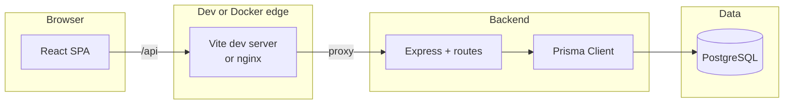
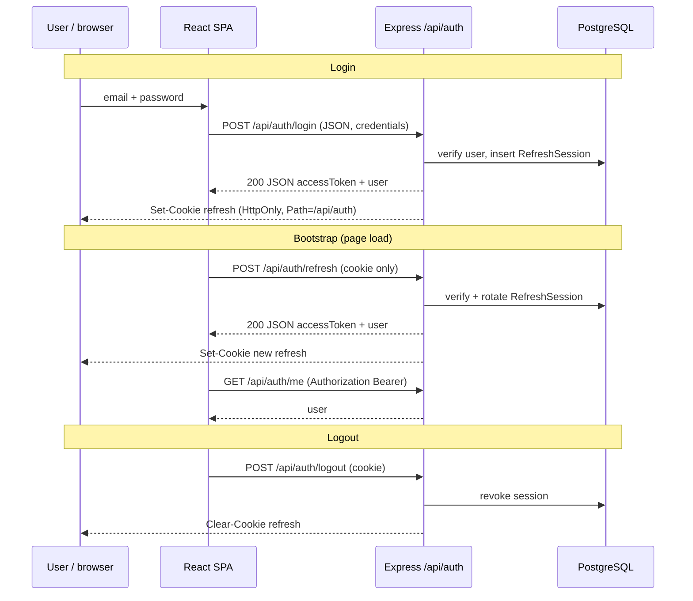

# Architecture

This document describes how the template is structured and how the main systems interact. It complements the setup steps in [README.md](./README.md).

## High-level overview

The app is a **monorepo**: a React SPA talks to an Express API over **`/api` on the same origin** in both local dev and Docker. That same-origin rule matters because the **refresh token** is stored in an **HttpOnly cookie** (not readable by JavaScript); the **access token** is a short-lived JWT returned in JSON and held in memory on the client.



- **Local dev:** Vite serves the SPA on port **5173** and **proxies** `/api` to Express on **3001** (`frontend/vite.config.ts`).
- **Docker (prod-like):** nginx serves the built SPA on **3000**, proxies `/api` to the backend, and uses `try_files` so client-side routes still load on refresh (`frontend/nginx/default.conf`).

Avoid pointing the SPA at `http://localhost:3001` unless you intentionally configure cross-origin cookies (`SameSite=None; Secure`).

## Login & session design

This template uses a **dual-token session**: a **short-lived access JWT** plus a **long-lived refresh JWT** delivered as an **HttpOnly cookie**. The choices below trade convenience against common web threats (especially **XSS** and **token theft**).

### What we are optimizing for

| Concern | Approach in this template |
|--------|----------------------------|
| **XSS reading long-lived credentials** | Refresh token is **not** exposed to JavaScript (`HttpOnly`). It never lives in `localStorage` / `sessionStorage`. |
| **Stolen access token window** | Access JWT is **short-lived** (default `JWT_ACCESS_EXPIRES_IN`, e.g. minutes). Stolen from memory/network has limited lifetime. |
| **Server-controlled logout / compromise** | Each refresh issuance creates a **database row** (`RefreshSession`); logout and refresh **revoke** or **rotate** rows so old refresh tokens stop working. |
| **Refresh replay / rotation** | On **POST `/api/auth/refresh`**, the server verifies the JWT, matches the **stored hash** of the exact token, then **revokes** the old row and **creates** a new session (rotation with `replacedByTokenId`). A leaked old token cannot be rotated again once replaced. |
| **CSRF on cookie-backed endpoints** | Refresh cookie uses **`SameSite=Lax`** (default cross-site GET behavior is safer). Cookie **`Path=/api/auth`** so it is only sent to auth routes under that path, not every same-origin request. Refresh is **POST** (not GET). |
| **Brute force & abuse** | **Per-IP rate limits** on signup, login, and refresh (`backend/src/middleware/rateLimitAuth.ts`). |
| **Misconfigured browsers hitting wrong origin** | **Same-origin `/api`** (Vite or nginx proxy) + **CORS allowlist** with `credentials: true` so only expected SPA origins send credentialed requests. |
| **User enumeration on login** | Failed login returns the same **generic** message whether the email exists or not (timing may still differ in theory). |

Paths **not** taken (and why), for clarity:

- **Refresh token only in `localStorage` / SPA memory** — Any XSS can exfiltrate it and mint sessions until expiry; no server-side revocation list is consulted on each use unless you add extra machinery.
- **Single long-lived JWT in the client** — Same XSS problem; revoking means blocklisting tokens or rotating secrets globally.
- **SPA on one origin, API on another without careful cookie policy** — Refresh cookies need `SameSite=None; Secure` and tight CORS; this template avoids that by default.

### Token split: access vs refresh

- **Access token** — Signed with `JWT_ACCESS_SECRET`, payload includes `sub` (user id), `email`, `type: "access"`. Returned in **JSON** on login, signup, and refresh. The SPA keeps it **in memory** (axios default `Authorization` header via `setAccessToken` in `frontend/src/auth/api.ts`). Used for **stateless** API auth (`requireAuth` middleware).

- **Refresh token** — Signed with `JWT_REFRESH_SECRET`, payload includes `sub`, **`tokenId`** (opaque id), `type: "refresh"`. The raw string is set as the **`Set-Cookie`** value in `setRefreshCookie` (`backend/src/auth/cookies.ts`): `httpOnly: true`, `path: "/api/auth"`, `sameSite: "lax"`, `secure` when `NODE_ENV === "production"`, and `maxAge` derived from the JWT `exp`.

On login/signup, the handler creates a `RefreshSession` row with **`tokenHash`** = SHA-256 of the refresh JWT and **`tokenId`** from the payload (`backend/src/api/auth/index.ts`). The server never needs to store the plaintext refresh in the DB for validation beyond comparing hashes on refresh.

### End-to-end flows

**Login / signup** — Client sends email/password (JSON). Server validates (Zod), hashes password with **bcryptjs**, creates user (signup) or verifies password (login), creates `RefreshSession`, returns JSON `{ accessToken, user }` and sets the refresh cookie (not echoed in JSON).

**App load (bootstrap)** — `AuthProvider` calls **refresh** (cookie sent via `withCredentials: true`) then **`/me`** with the new access token to hydrate `user` (`frontend/src/auth/AuthContext.tsx`). If refresh fails, client clears in-memory access and user.

**Authenticated API calls** — Browser sends **`Authorization: Bearer <access>`** for routes that use `requireAuth`. The refresh cookie is **not** required for those unless you explicitly call auth routes.

**Refresh** — Client **POST**s `/api/auth/refresh` with no body; cookie carries the refresh JWT. Server verifies signature + DB session (not revoked, not expired, **hash matches**), rotates session, returns new access JSON + new `Set-Cookie`.

**Logout** — **POST** `/api/auth/logout` with cookie; server revokes the matching session (best-effort if JWT invalid) and **clears** the cookie with matching path/options.



### Configuration knobs (auth-related)

Secrets and lifetimes live in env (`JWT_ACCESS_SECRET`, `JWT_REFRESH_SECRET`, `JWT_*_EXPIRES_IN`, `REFRESH_COOKIE_NAME`). Rate limit windows are code in `rateLimitAuth.ts`. CORS allowed origins: `CORS_ORIGIN`.

---

## Frontend

**Stack:** React 19, Vite 7, TypeScript, Tailwind CSS, React Router.

**API calls:** The app should call **relative** `/api/...` so requests stay same-origin through Vite or nginx. With **`VITE_API_URL` unset** (recommended), the client uses the current host; set it only if you accept the cookie/CORS implications of a separate API origin.

**Auth UX:** `AuthContext` loads the user after login/refresh, keeps the access token in memory, and wires axios (or equivalent) to send `credentials: 'include'` for cookie-backed refresh. Guest-only routes and protected routes live beside the router setup in `App.tsx`.

**Build:** `npm run build` in `frontend` produces static assets consumed by nginx in Docker or any static host.

**Env:** See [Frontend environment](#frontend-env) below. Examples: `frontend/.env.example`.

---

## Backend

**Stack:** Express, TypeScript, Prisma, `jsonwebtoken`, `bcryptjs` for password hashing.

**Entry:** `backend/src/index.ts` wires middleware (CORS, JSON, cookies), mounts API routers, and starts the HTTP server.

**Auth API:** Under `/api/auth` — login, signup, refresh, logout, and a `me` endpoint for the current user when a valid access token is supplied. Login/signup set the refresh cookie; refresh rotates the session server-side and returns a new access token; logout clears the cookie and revokes the session.

**Supporting modules:** Cookie helpers (`backend/src/auth/cookies.ts`), JWT and password utilities, Prisma client (`backend/src/db/client.ts`), and rate limiting applied to auth routes.

**Env:** Database URL, JWT secrets and lifetimes, cookie name, CORS origins, port — see [Backend environment](#backend-env).

### Trying auth with `curl`

The refresh token is **not** in the JSON body; use a cookie jar:

```bash
# login (stores Set-Cookie in jar)
curl -c /tmp/auth.cookies -X POST "http://localhost:3001/api/auth/login" \
  -H "Content-Type: application/json" \
  -d '{"email":"demo@example.com","password":"Password123!"}'

# refresh (sends cookie)
curl -b /tmp/auth.cookies -c /tmp/auth.cookies -X POST "http://localhost:3001/api/auth/refresh"

# me (use accessToken value from login/refresh JSON)
curl -H "Authorization: Bearer ACCESS_TOKEN_HERE" "http://localhost:3001/api/auth/me"

# logout (clears cookie server-side)
curl -b /tmp/auth.cookies -X POST "http://localhost:3001/api/auth/logout" -i
```

---

## Database

**Engine:** PostgreSQL, typically run via Docker for local dev (`npm run db:up`).

**ORM:** Prisma (`backend/prisma/schema.prisma`, migrations under `backend/prisma/migrations`). `DATABASE_URL` in backend env points at the database.

**Models (conceptually):**

- **User** — `id`, unique `email`, `passwordHash`, optional `displayName`, timestamps; one-to-many **RefreshSession**.
- **RefreshSession** — server-side refresh rotation: `tokenId`, hashed token, optional `userAgent` / `ipAddress`, `expiresAt`, optional `revokedAt` / `replacedByTokenId`, linked to **User** with cascade delete.

**Workflow:** After Postgres is up, `npm run db:migrate` applies migrations; `npm run db:seed` seeds demo users via `backend` scripts (see README for credentials).

---

## Docker & Compose

| File | Role |
|------|------|
| `docker-compose.yml` | Base services and shared wiring |
| `docker-compose.local.yml` | Overlay for **Postgres only** (used by `db:*` scripts) |
| `docker-compose.prod.yml` | Full stack overlay; uses `backend/.env.prod` |

**Patterns:**

- Local DB only:  
  `docker compose -f docker-compose.yml -f docker-compose.local.yml up -d postgres`
- Full prod-like stack:  
  `docker compose -f docker-compose.yml -f docker-compose.prod.yml up --build`  
  (root script: `npm run docker:up:prod`)

Bootstrap production env (once):

```bash
cp backend/.env.prod.example backend/.env.prod
```

Compose prod loads backend/Postgres configuration from `backend/.env.prod`. Leave **`VITE_API_URL` unset** in the frontend build so the SPA keeps same-origin `/api` behind nginx.

---

## Environment configuration

### Backend env file naming

| File | Purpose |
|------|---------|
| `backend/.env.example` | Committed template — copy to `.env.local` |
| `backend/.env.local` | Local secrets/runtime (gitignored) |
| `backend/.env.dev` | Optional committed defaults for shared/staging-like setups |
| `backend/.env.prod.example` | Production template |
| `backend/.env.prod` | Production secrets (gitignored) |

**Typical flows:**

- **Local (`npm run dev`):** apps on the host; Postgres in Docker via `db:up`; use `.env.local`.
- **Docker prod overlay:** vars from `backend/.env.prod`; SPA built without `VITE_API_URL` for same-origin API.

### Frontend (`frontend/.env`)

| Variable | Description |
|----------|-------------|
| `VITE_API_URL` | Backend base URL (no trailing slash). **Leave unset** for local dev and default Docker so the SPA uses same-origin `/api` and HttpOnly cookies work. |
| `VITE_APP_TITLE` | Browser tab title; defaults if unset. |

See `frontend/.env.example`.

### Backend (`backend/.env`)

| Variable | Description |
|----------|-------------|
| `PORT` | HTTP port (default `3001`). |
| `CORS_ORIGIN` | Comma-separated allowed origins (defaults include localhost on `5173` and `3000`). |
| `DATABASE_URL` | PostgreSQL URL for Prisma. |
| `JWT_ACCESS_SECRET` | Signs access tokens. |
| `JWT_REFRESH_SECRET` | Signs refresh token payloads / rotation. |
| `JWT_ACCESS_EXPIRES_IN` | Access token TTL (e.g. `15m`). |
| `JWT_REFRESH_EXPIRES_IN` | Refresh token TTL (e.g. `7d`). |
| `REFRESH_COOKIE_NAME` | HttpOnly refresh cookie name (default `refresh_token`). |

See `backend/.env.example`.

---

## Scripts reference

**From repo root:**

| Script | Purpose |
|--------|---------|
| `npm run dev` | Frontend + backend in parallel |
| `npm run dev:backend` / `dev:frontend` | One app only |
| `npm run build` | Build backend then frontend |
| `npm run install:all` | Install root, backend, and frontend dependencies |
| `npm run db:up` / `db:down` | Start/stop local Postgres container |
| `npm run db:logs` | Tail Postgres logs |
| `npm run db:ps` | Postgres container status |
| `npm run db:migrate` | Run Prisma migrate from local backend |
| `npm run db:seed` | Seed demo users |
| `npm run docker:up:prod` / `docker:down:prod` | Start/stop full prod overlay stack |

Each package also has its own `package.json` scripts; see `frontend/README.md` and `backend/README.md` for package-level details.

---

## Repository & template notes

- **Single git repo at the root** — the root `.gitignore` avoids nested `backend/.git` and `frontend/.git` so the project stays one tree.
- **Sample app:** React Router drives pages such as `Home` and a sample `/test` route in `App.tsx`. The navbar may live on a page for demo purposes; for real apps, shared chrome usually belongs in a layout route in `App.tsx`.
- **Customization:** Replace the sample “fetch message” / demo flows with your API and UI; tighten CORS, env, and Docker for your deployment target.
